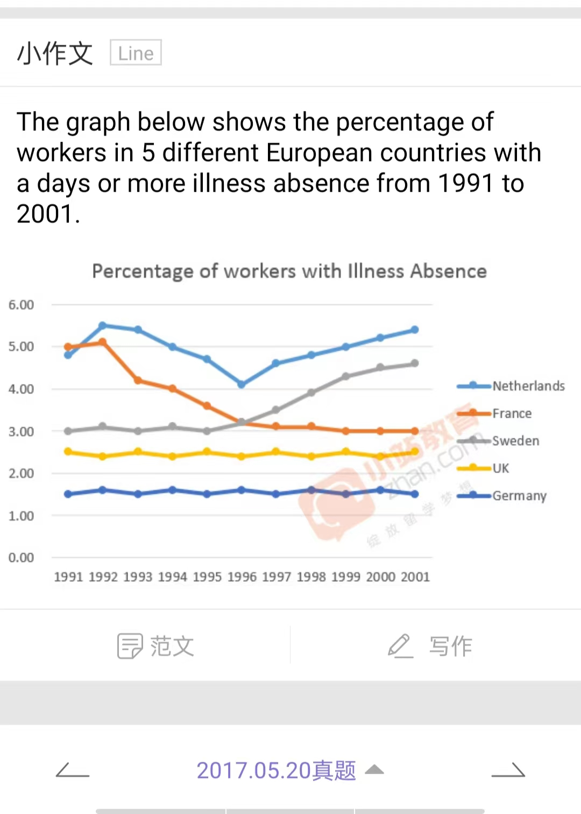
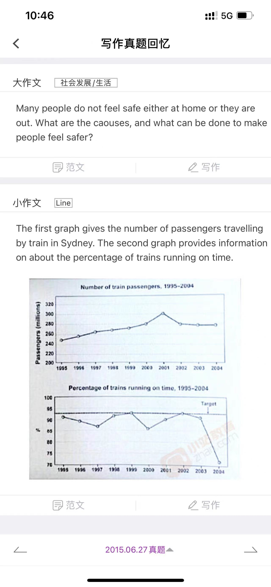
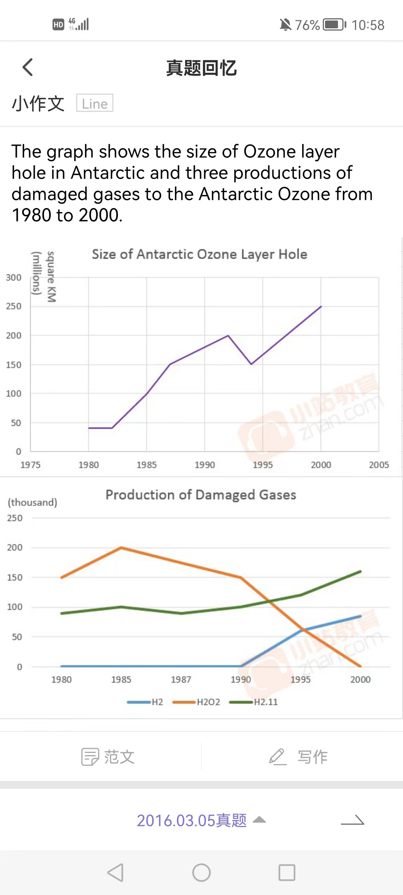
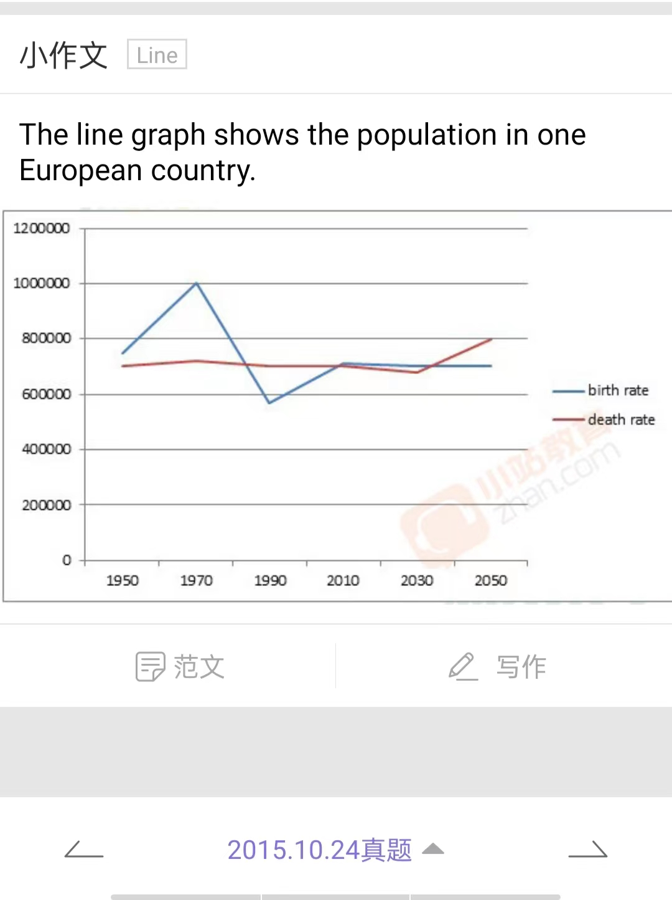
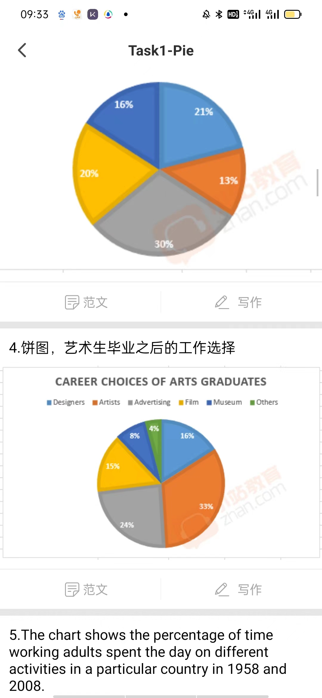
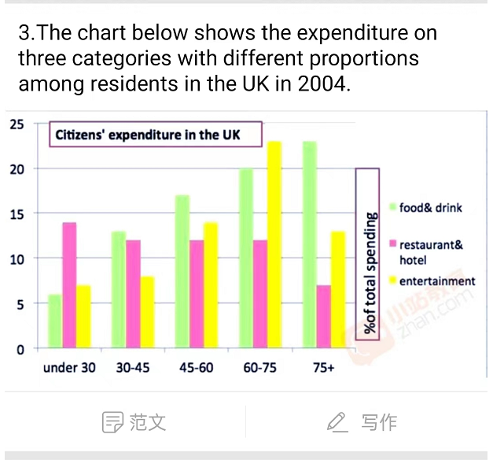
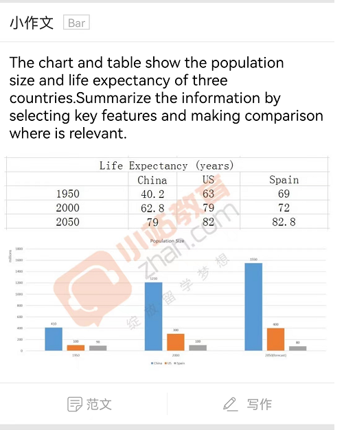
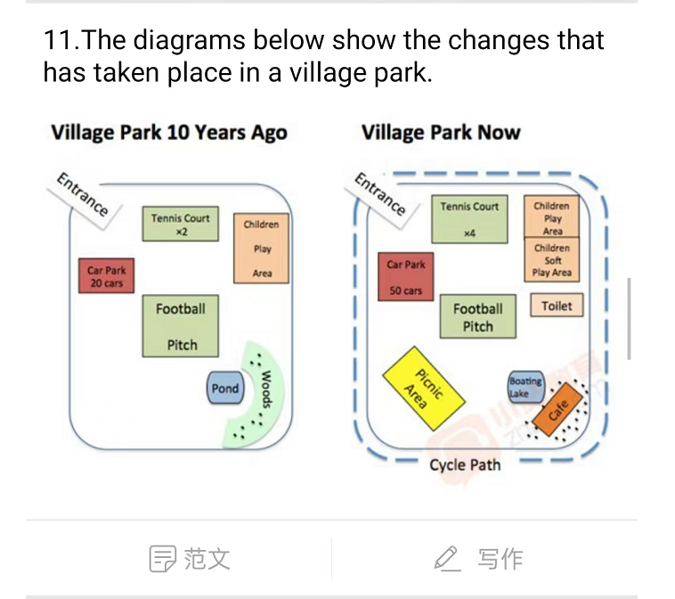

# Preparations for IELTS

## Speaking Part

### Part One

#### 1. Hometwon

###### 1.Where's your hometown?

Well, that's Jinan, just right here, the captical city of Shandong Province, which located in the east part of China. Jinan is quite a beautiful place, and it is surrounded by mountains, despite the north side, there's a huge lake there, which is called Daming Lake. And there's plenty of springs not far from the lake, like the Baotu Spring. Anyway, that's my hometown, a beautiful place.

###### 2. Is that a big city or a small city?

Hmm, though it has been choosen as the captical city of Shandong Province, i don't think that's a big city. As a matter of fact, in my prospect, it is a small city. As for the reason, I use to live near Quancheng Square, the center of this city. And later my parents moved to a department near Erhuan South Road, the south part of Jinan. Then, my high school is near Mount Hua, the north part of Jinan. At now, I live near the moutains in South East of Jinan, and there's a big train station on the North estern Jinan, it takes less than an hour's drive to get there. So in my opinion, that's quite a small city, for i have been to almost every part of Jinan and it won't take long to get through it.

###### 3. Is there anything you dislike about it?

For most people in my city, they would say the heavy traffic jam, and that's for sure a huge disadvantage living in such a crowded city. But I live uptown and have not suffered a lot. What bothers me the most was the the wether here. Spring is really short, maybe only a few days. And almost all of the days are windy. So does Autumn. Summer days are hot with heavy sun. And when it rains, it's usually rains cats and dogs, lasting for several days.  I enjoy playing in snow and make snowman in winter, but winter days are cold and dry, usually unfit for playing outside. And that would be all, everything else is quite find at present.

###### 4. What do you like (most) abot your hometown.

Well, I like those beautiful mountains in my hometown. Despite the well-known Qianfo Mountains, which is a famous cultural relitic, I like the mountains just lay behind my home the most. I am someone who works all day and looking for somewhere to get myself relaxed in the weekend, and these wild mountains are exactlly what I need. When I'm free on weekends, I would pack some food and go hiking in the mountains. The air is really freash, and the singing of the birds, the smell of nature, they really impressing and relaxing. So honestly those mountains behind my home are what I like the most in hometown.

###### 5. Do you like living there? / Do you like your hometown?

Not exactlly. I've been living here for so many years, I can feel the friendly citizens and the nice city. But the weather here isn't so nice to me. It's really hot in summmer days and so cold and dry during winner. I'm currently studying in Shanghai, and I'm feeling like the wet and cool weather in Shanghai. That's perfect for me, as my nose was allergic to dry air. So, maybe I should say I don't like living in my hometown quite much, but I still love here because it's where I grow up and where I live.

###### 6. How long have you been living there?

Emm, for almost 18 years? I've born in this city and have living there since then. We moved several times but still in the town. Before I enter the elementary school, my parents and I live in the city center. Then, in order to enter a good elementary school and senior high school, we moved to the south part of Jinan, where i can go to the best school here. And recently, I was a college student in ShangaiTech University, I spend most of my time in Shanghai, and my parents also moved to a house near the mountains. And that's all until now.

###### 7. Please describe your hometown a little.

Well, sure. My hometown, Jinan,is a beautiful city surrounded by mountains in three sides. In the north of Jinanthere's a huge lake called Daming Lake. When talke about jinan, I must mention the Springs there. By the way, Jinan has a nick name, called The Spring City, that's because it has so many Springs, like the most famous one, Baotu Spring. Despite that, there are plenty of Springs in every corner in the city, and it is said that in the old days, every family has its own spring in there garden. They used it to cook, to make the tea, and for daily use. I used to live in the city center and tasted lots of the springs. At present, I live in the south eastern part of Jinan, next to the mountains, I usually go hiking in the mountains on weekends or vacation, when you walk in the mountains, you'll feel relaxed, and the air is really fresh. What I can see are endless mountains, really fantasic.

###### 8. Do you think you will continue living there for a long time?

Well, no. At present, i'm studying in an University in Shanghai. And i only come back to here, my hometown, on vacations. If everything goes well, i would go for further study and may not continue to living in Jinan. Maybe in the future I will seek for a job in some of the major citys like Shanghai or Shenzhen. And then i will come there much less frequently.

#### 2. Home/Accommodation

###### 1. Can you describe the place where you live?

Yes, I live in a house in the south-

### Part Two

#### 7. 积极改变.

> *Describe a positive change that you made in your life.*

##### Answer

I used to stay up late playing phone games or surfing online in the first year of my senior high school, sometimes in the morning, I had to get up in a hurry and ran to school, but still there were several times I was late for class. And I often felt asleep in afternoon classes. My grades went down gradually.

I found my deskmate always could keep concentrated on class. And he told me he usually was the first one to arrive the classroom, so he could have enough time to prepare for classes.

Then he told me jogging made him energetic all day. Jogging along the path in the park is also a good time for him to think about important things in life. I decided to jog with him.

You know, I used to get up late, so it was fairly challenging for me to get up early. After jogging three days, I wanted to give up. My friend told me that, if you made a goal, then you should try to make it, or you’d better don’t make the goal. He told me it’s terrible to be a person who often makes goals and gives them up.

I think the habit of jogging can help me to keep good health and ensure me with good energy for study, so I want to develop it.

##### Part 3

###### 4. What are the disadvantages when people keep making changes?

1) if xxx, have to adapt to new environment frequently, and everythime you'll have to spend time knowing things around you, that for sure one of the dis';
2) Also, keep make ing , maybe you will have a sense of unsteadiness,cause you don't stuck to a place for a long time and you move to another unfamilar env. That's might be fine for an energitic young man, but if chid or ,,..... they may feel upsed and unsecutity.
3) Last but not the least, always at the beginning, you started to do many thing but you may not done them, and thus you cannot get the sense of achievement, cause you haven't done any of them, though you've do a lot of things. That would be really disappointing.

#### 11. 帮助小孩

> *Describe a time when you helped a child*

##### Answer

last weekend, after dinner, I went out for a walk in my community as usual.

a child was riding a bicycle. He rode fast, when he turned around a corner, his bicycle was a little out of control, he fell down. I was walking there. I didn't find any adults with him, so I helped him up. But his bicycle chain was out of the track. I tried to help him to put the chain back, but we didn''t make it. Then I searched some helpful videos with my smart phone, with the assistance of the child and the help of videos, we fixed the bicycle finally.

Well, for the reason why I helped him. I guess I'm a kind person, to be honest, I just helped him without thinking anything.I felt it's just a common help. If I meet some difficulties, my neighbors will offer me helps as well.

I'm a good neighbor.

// find a boy. hurt. clinic was not open late at hight.clean his wound. send his home.  parents grateful to me.=t

natrually, didn't think a lot.

6 Suggent

* Requirements
* Recommend(advice).
* Why recomment
* FIt him?
* Then he have fun
* He's apprecite.

##### Part 3

###### 1. Do you often help kids? How?

Not quite often, cause there's not many children in my neighborhood. But I remenber sometimes in a park or on the street, I may...'

###### 2. Why is it necessary to do volunteer services?

Social conscience.

###### 3. What can schoole do to develop students' awareness of volunteering?

###### 4. Who benefit more from the volunteer services, the volunteers or the prople helped?

It's hard to say, because both of them have gained something during the volunteer jobs.

P3.3

Honesty outging good at communication. patient, understanding

spend time to figure out right/wrong.  Fotget to think by them self.

special time have a special meaning for an individual.

#### 12. 交通拥堵(NEW)

##### Answer

I would tallk about a time when I need to go to the city center to take an English lesson in the early morning. That was the day when I was stuck in a heavy traffic jam. Knowing that reaching the city center would go through a very busy road, so I got up early and took a bus there. Unluckily, I mistaken the time it takes to reach there. When I was just about to arrive, maybe about one block to get to the bus stop, it was totally stucked.  Nothing has caused this traffic jam but too many cars on this road. What I could hear was the horns. I felt annoying so I put on my earphones and played some of my favorite music, which can make me feel relaxed. Sitting near the window, I looked at the cars, they didn't seem to move for any. And about half an hour later, It finally arrived and definately I was late for the class. It was an unpleasent trip, and I would set out earlier the next time.

##### Part3

###### 1. How can we solve the traffic jam problem?

1) to complete transportation system
2) to implement staggered shifting(单双号限行) on traffic system;
3) to encourage people to take public transportation;

###### 2. Do you think developing public transport can solve traffic jam problems?

Yes, I think so. Private cars occupy much more space on the road than public transportation to transport the same amount of people. And some private cars sometimes pull over casually, to some extent, that can increase traffic jam problems.

###### 3. Do you think the high ways will help reduce traffic jams?

I think so. That mainly because there are many traffic lights to stop cars, that will reduce traffic jams more or less. Drivers can't pull over casually on the high ways. What's more, there aren't pedestrians on the high ways, that can also lower down the amount of traffic jams.

###### 4. What are good ways to manage traffic?

1) to part the pavements from the drive lanes and bicycle lanes;
2) to set more traffic lights;
3) to make more traffic signs;
4) to improve public transportation system;
5) to encourage people to take public transportation more;

### Object and Activity

#### 1. 希望养成的习惯

Describe a habit your friend has and you want to develop.

##### Answer

China has a really long history of growing tea. Many people in my country have the habit of drinking tea. One of my friends has keeping the habit of drinking tea for nearly 10 years. She knows a lot about it, for example, she can name out nearly 20 kinds of different types of tea.

I first noticed her habit in my high school. The time of high school is the busiest time for students in China. We have to stay up late and get up early to cram for good results. I usually felt sleepy at that time, sometimes, I even could fall asleep in the class. I tried to drink coffee to keep me refreshed. But I guess coffee might be too strong for me, sometimes after drinking it, my hands would shake, my heart might beat fast or I would be too excited to sit there for a long time.

My friend suggested me to drink tea. I took her advice. The tea water tasted very mild. The smell of tea keeps me refreshed. After I had tried several times, I realized that tea was a perfect drink for me.  It's not strong; it keeps refreshed, but not very excited; I think it's suitable for Asian people; So I want to develop this habit.

(Actually, tea is more than a drink. I know it was ever the most important products on Silk Roads. It conveys Chinese history and civilization.)

##### Part 3

###### 1. What habits should children have?

....should shape some good habits when they are young; ensure they with good health/ good development;

to get up early; to do reading; to put away toys; to be punctual/on time; to do some preparation before doing sth.; to keep their promises;   punctuality

###### 2. What should parents do to teach their children good habits?

parents:

1. tell them why should people develop good habits;
2. keep good habits firstly; set good examples;
3. be strict to help children to form some good habits.

###### 3. What influences do children with bad habits have on other children?

  ...will learn from each other; but by comparison, bad habits are easy to form/shape;

with the influences of those children with bad habits, other children may no long obey regulations/manners/rules;

Some bad habits can have influences on other children's attitude towards study, health, value and so on.

###### 4. Why do some habits change when people get older?

physical energy/ health: don't have good energy to stay up late; give up smoking or drinking because of health problem;

#### 2. 困难的决定

Describe a difficult desicion that you once made.

##### Answer

> When I was in the first year of high school, I met my first difficult decision in my school life, it was to choose to study arts or sciences;

> It will related to my future major in university and future job option;
>
> Before made the decision: compared the 9 subjects I was studying;
>
> I was not good at physics and politics; politics is a main subject of arts; physics belongs to science; that made the decision more difficult to make;
>
> I didn't have obvious preference on arts or science, so I used the ranking of arts and sciences to decide my subject.

---

People probably have changed their plans for various reasons. Recently, I changed my future study plan. To be honest, it was a big change for me.

In the three days, from 6^th^ to 9^th^ in June, I attended the university entrance exam. The result was not as good as I had expected, but still not bad. Then I applied my ideal university and I was enrolled.

In China, the university admission policies are different from most of other countries. Students who have passed the enrollment cut-off score/line still have few options to apply the majors that they are interested in.

Actually, I was enrolled by a major called International Trade which I totally knew nothing about. So I didn't think I could have motivation to go further study in that filed.  After discussing with my parents, I decided to study abroad.

I felt changing my study plan was a good decision. Coz I wanted to follow my heart. And also, I felt so grateful for my parents' support. You know, the oversea university tuition fee is a burden for a family. So I'll try my hard to start an independent life. Well, homesickness is another thing I should concern.

##### Part 3

###### 1.What decisions do people usually make in their daily lives?

daily routines;

to get up early or late; to dress what; to eat what; on what time to go out;

###### 2. Which is easier, making a decision by yourself or making a decision after group discussion?

That should depend on how big the responsibility I should take after making the decision. For example, the decision about a project or a work, ...

Private stuff: like to make decision by myself; make me to be confident;

I prefer to make a decision by myself. Because, having a group discussion with others, they may come up with different ideas; it will be hard for me to choose;

I like to to make a decision after a group discussion. Because I can't consider overall; not confident enough to make a decision; not decisive;

###### 3. Why are many young people unwilling to follow their parents' advice?

1) They are grown-up; they are mature and capable enough to make decisions by themselves; have their own ideas
2) parents control them too much
3) generation gap: parents may old-fashioned; can't catch up with the trend;
4) young people are eager to have chance to make decision;

###### 4. Why would middle-aged people tend to second-guess(预测) their own decisions?

middle-aged: have to take the responsibility of nurturing their young children and take care of old generation as well; so they have much pressure and burden from life; make them cautious to make decisions; sometimes, they may can't take the bad consequence; so... second-guess....

not decisive;

have experienced many things: can foresee something;

#### 3. 自行车/摩托车/汽车旅行

Describe a bicycle/motorcycle/car trip you ***would like*** to go.

##### Answer

 I like travelling. Being to different places bring me back a lot of good memories. And I think my horizon is also widened.

And recently, I have been planning to have a car trip to Inner Mongolia. If my parents can have their annual leaves for a week, I'd like to go with them. You know, travelling with parents would be good family time; and being out with them, I can save much money on travelling.

I've browsed some travel websites. They all said that the best time to go to Inner Mongolia is at the end of its summer. At late July or early August, the grass is tall and green, the sky is blue with good sunshine, the weather is moderate, and so it's the best time to ride a horse to experience the beautiful natural scenes of the  **prairie** .

Inner Mongolia has very low population density. The public transportation is not very good in some (rural) places, but those places have the best natural sites, so it's better to go there by private car. That's one of the reasons why I'd like have a car trip there. Besides, I plan to have some camping there; so we need to take more belongings like camping tents, picnic tables and so on. That's the other reason why...

Carnivore; carnival; drive license;

#### 4. 想学的一项有趣的技能

Descrbe a skill you are interested in and want to learn more about.

##### Answer1

There is a skill that I want to learn more, it's ice skating;

When I was young in primary school, my friend took me to an ice-skating center at a weekend; he was good at it; I could roller skate, so I thought ice-skating wasn't difficult for me; but the ice was much more **slippery** than the ground; I fell down several times. The last time when I fell down, I broke my nose heavily. When I stood up, my nose couldn't stop  **bleeding(流血)** .  Then I was sent to a hospital and had an operation on my nose. After that, my parents didn't allow me to skate again.

I want to continue learn it, coz I think skating is interesting. I can't run fast, so I very enjoy the **speed** that the skating brings to me.

I plan to ask 2 or 3 friends who are good at skating to help me to learn. You know, last time, when I first did ice-skating, I hurt my nose. I think one friend maybe not enough to help me.And I'll go to a skating center with my friends to learn it. That's how I would like to learn.

##### Answer2

I want to develop a kind of defensive skill -- called Aikido. I first knew about it when I was about 10 years old in my primary school. My father thought I needed to learn a kind of sporty skill to develop my braveness. One day, he took me to an aikido studio. I saw several people were there in a circle. The coach was in the middle. When the people attacked the coach, he used some skillful techniques pulling down all of them in a minute. My father told me that the coach needn't use much strength, he only borrowed the power from the attackers. To be honest, the skill was really cool. But I had some difficulties to communicate with strangers or new people at that time, I even refused to stay with my classmates after class. Sometimes, when guests came to my home, I would stay in my room until they left. I had one aikido class, the time in that new environment with strangers made me really uncomfortable. Although I was interested in aikido, I still refused to learn it continuously.

Now, I'm outgoing, and I think it's necessary for girls to learn some defensive skills to protect ourselves. And aikido doesn't require much on strength, it's suitable for girls. If I have this skill, it will be....

> Tai Chi / Shadow Boxing
>
> Tai Chi is an ancient Chinese internal martial art system, which combines profound principles, theories and martial art techniques. The slow, soft and continuously flowing movements appear mysterious on the surface. However, it is the cultivation of one's internal energy, mind and the physical body that make it so unique and challenging. To generate relaxation, Tai Chi practice requires a deep level of concentration and a focused mind, thus allowing the mind to lead and guide the body's energy.
>
> Tai Chi is not only a martial art, but has also been widely acknowledged as being an effective health exercise. Whether Tai Chi is practiced for health, as athletic sport or martial art it takes time, patience and qualitative practice to develop Tai Chi's internal properties. To achieve a high standard in Tai Chi training is a highly complex process.

#### 5. 想送朋友的礼物

Describe a gift you would like to buy for your friend.

What gift you would like to buy

Who you would like to give it to

Why you would like to buy a gift for him/her

And explain why you choose that gift

##### Answer

1.My friend’s birthday is in next month. I’d like to buy a book for him. There is a book called The Wandering Earth. It is a sci-fi novel which is written by Liu Cixin---a famous novelist in China. This book is also my favorite.
2.I read the book about a year ago. Actually I watched the movie firstly. This movie in that year got a very good hit. Reading the same title novel is popular for young people. So I bought the book and read.
3.My friend is a sci-fi buff. The book tells a story that takes place in the future. The sun is dying. Human beings are forced to migrate to a new star system. All the countries unite together, with the help of technology and nuclear energy, scientists find a way to give the earth the motivation to fly away from solar system.
4.I want to buy this book because of its impressive description of the scientific facts and the well-organized plot. Plus, it’s an educational book, from it I have learned some knowledge about universe and something about love, care, responsibility and hope; Besides a sci-fi buff, my friend is a bookworm. So I think it would be a good gift.

A pen, of hero brand.

To my best friend, who was also my classmate in high school.

He helped me a lot. And his handwritting was really beautiful.

Such pen like this, I think he will like it , and aslo the band, hero is a native coumpany. Using it to write chinese character would be fine.

> It is the device which makes possible to note down our thoughts in a piece of paper. The earliest pen were quills, ink brush, etc. The end was generally sharp modification to those wooden pieces or the feathers, which had to be dipped in ink and then written on paper.

> **Pen is a student’s best friend**. It is everything that a student need in order to write what he knows in exam. And this takes them far in life when used properly.
>
> Well now there are lots of pen available. It fits every pocket. Modern pen generally have a replaceable refill with a metal nib. Ink pens are also developed now. The costs might be as low as 2 rupees to luxury pens costing crores. The purpose is however same. So it can be well understood how powerful it is. It is rightly said. A pen is mightier than sword.

##### Part3

1. When do people normally send gifts to others?
2. Do people give gifts or red packets on traditional festivals?
3. Is it hard to choose a gift?
4. Will people feel happy when receiving an expensive gift?

#### 6.一件难做的事

Describe a diffcult thing you did.

##### Answer

1. I think there’re many practical skills we’d better have, like cooking, driving and so on. So we can start an independent life better. Today I want to talk about driving.
2. Mother thinks I won’t have enough time to learn to drive if I study abroad. So she suggests me to learn driving in China. In my country, the only place to learn driving is driving school. I attended driving classes in a driving school near my home.
3. In my country, we have to pass 4 subjects to get the driving license. The tests are strict. So the passing rate is very low. I had spent nearly half a year on learning it. To be honest, my sense of direction is very poor, I often drove to the opposite side when I practiced. Even after practicing many times of drive backward, I still couldn’t drive the car to the exact place.
4. I think driving is an indispensable skill for people in modern life. People in big cities often go to work far away from home. More and more people choose to drive to work in recent years. Driving saves them a lot of time. Kids or the old in some families, when they go out, those family members who can drive can take them out more convenient.

参考一：

1) Buy the mascot of Winter Olympic Game; Bing Dwen Dwen;
2) Had been to many stores; and searched online; at last asked one of my relatives in Beijing to buy in a  **franchised store** .
3) A furry panda with an ice crystal shell;  The mascot is chubby, cute and lovely; its smile is sweet; very popular;
4) Due to the pandemic, many workers couldn't go back to the factory to make the mascot, so the shortage of Bing Dwen Dwen is big; when I heard the selling of it was limited, I thought I might couldn't get one. ....

参考二：

1) To buy a book for sb.;
2) Went to several bookstores; searched online;
3) Popular; the movie just got a hit;
4) bought it; sb. was very happy and excited; it was worthy;

##### Part3

1. **What kinds of jobs require people to be confident?**

1) Those jobs that.... need to show up in front of camera/public;

actor; interviewer; host; politican; Confidence can help them to set up a good image to the public...;

2) athlete: Confidence can give them more motivation to compete with others;
3) salesperson: …can persuade others better;
4) teacher: …to influence others well;

2. **On what occasions should children be encouraged? Why?**

1) be afraid of doing sth. new;
2) too shy to do sth.
3) fail in doing sth.; e.g. learn riding a bike;
4) do well in sth. ; encourage them to do better;

3. **How do you help children stay focused?**

1) shouldn't interrupt them when they are focusing on doing sth.
2) give them some rewards when they can stay focused for a long time;
3) to do the things with them; encouragement; sense of safety;
4) set an o'clock

4. **What challenges do young people face today?**

1) various exams;
2) job hunting;
3) to support a family
4) to buy a house
5) to have a baby

environmental problems; resource shortage;

#### 7. 收到特殊蛋糕

Describe a special cake you received from others.

#### 10.印象深刻的课程

Describe a course that impressed you a lot

I'm going to talk about the area of biology. I started to learn it when I was at middle school. It was a compulsory subject at that time.

Actually, I started to have interests in biology much earlier than I learning the subject. I ever fed a pet cat and some pet turtles when I was young. In order to feed them well, I learned something from the internet. I thouas interested in biology since then.

In middle school, my biology teacher often showed us animal samples, like rabbit, frog, fish and so on. Sometimes, he took us out of the classroom to observe the ants moving, the birds nesting, the butterflies flying and something like that.

By learning this subject, I knew that humans are not lonely on this planet. With the help of biology lab equipment, could I've seen many animal samples, and observed the cell, the bacteria, and so on. ....

Computer Science

Parents, laptop, CDs cartoon, interested in it.

middle school, our computer science teacher, was a nice kind lady,

She taught us the basic use of the computer, like turning on or shutting down the PC, how to manage files. And the office software, she use it so fast and fluently, that she could make a whole calculated excel in a few minutes, the most important thing is that she was good at teaching, everyone loved her class.

 beside those on textbooks,she told us the what newest technology like, she described the virtual reality, attractive. also she allows us to play the small games on the computer, like mine sweper and the card game. I was deeply attracted by the charming computer, and I think that strengthen the will that I'm going to major in computer science, and actually I did that. Currently I'm studing soft eng, that would own to my cs class and my kind teacher.

#### 11. 有趣的谈话

Describe an interesting discussion you had with your friend.

##### Answer

Starbucks(Green: stock market goes up; star: dreams; bucks: dollars; the statue of liberty 自由女神);

I remember a really fascinating conversation I had with my friend years ago. The person who I spoke with was a good friend of mine since when we were little kids. ~~He was studying astronomy at the university, so he was kind of an expert,~~ he was kind of a wiz on everything related to space: stars, black holes that kind of thing.

I don’t know anything about that, one time we went out to my cabin which is kind of a beautiful place. There’s a lake and you can see the the night sky really well at night – you can see all the stars. It’s really quite beautiful, we were on the beach, we were kind of just chilling drinking a few beers and enjoying the really peaceful time.

He started talking about kind of like the history of space which I thought was really interesting because you know I don’t really know anything and he talked about kind of the different stars; how far away they were from our planet; how many planets exist in the universe; how much time until our sun will burn out all these really kind of big things that I don’t know anything about really.

I learned a lot, I gained a lot of wisdom so I thought this was really interesting. I really enjoy spending time with this friend because he’s really knowledgeable in a field and he’s kind of a space buff we could say. Of course, I don’t know anything so I thought it really opened my mind. It really was mind-blowing to me, so it was a really cool conversation that I had with a friend at a very beautiful place.

1. Last summer vacation, I had a discussion with my friend about “to go where for vacation”.
2. Me: To go to some cities in northern China. It’s cool in summer.Friend: to got Nanjing, Shanghai in southern China. The views are attractive. Many historic sites and modern places.... Not as hot as I imagined;
3. My friend had been there before, he told me that,.......(Nanjing, Shanghai的体验, wax museum)
4. Through the discussion, I knew more about those attractive places; wanted to try local food.

##### Part3

###### 1. When do children normally form their own views?

To be honest, I'm not sure, but I guess it's probably ….about 2 or 3 years old;

to dress what; to eat what; to stay with mother or father;

###### 2. Do children have strong opinions?

  It depends on their personality.

  insisting;

###### 3. Should parents request their kids to obey them?

Should but not always.

Parents: should; their duty to teach kids; help kids to form good habits; to avoid some possible mistakes; to good man;

Parents are not perfect. They may be wrong sometimes.

Kids are individuals who can think independently. Need to be encouraged and respected.

###### 4. In what industries do you think communication is a necessary skill?

1) deal with public or different people;  salesperson; house agent;
2) hosting; teaching;

#### 12. 语言学习

Describe a thing you did to learn another language.

##### Answer

When I was in senior high school, I like to watch Japanese  **animation** , in my spare time. In order to have good viewing, I decide to learn Japanese.

Japanese is the most similar character to Chinese. Actually, it originates from Chinese. You can see that from the characters. In most cases, a Chinese person who doesn't know this language can know 50% of the meaning just from the Japanese characters.

To master a language is not easy. I had planned to learn it with some apps on my smart phone.** But there is a rule in my high school, any kinds of phone, ipad or laptop are not allowed to take to school....**

So I bought a paper Chinese-Japanese dictionary; You know to learn second language is not compulsory senior high school; I didn't have any Japanese teachers to ask for help; the dictionary helped me really a lot. I looked up the new words; and with the example sentences, I learned how to use the words correctly;

Well, to be frank, this dictionary was a big help. You know, Japanese is actually a quite difficult language; although many Japanese characters originate from Chinese, the tone, the grammar and the usage of Japanese can be very complicated, since Japanese uses different words on the same thing in different occasions. Without the help of the dictionary, I might not be able to learn this language.

##### Part 3

###### 1. What diffi

###### Imp

###### Alone/group

###### Best way

#### 13. 不喜欢的规则

Describe a rule that you don't like

1. I want to talk about an item of rule in my senior high school. The rule is that cell phone is not allowed to take to school any time.
2. To be honest, I don't like this rule. Because people now are living in a time of technology; if people don't keep a mobile phone with them, they seem to be unconnected with the world. I have a sense of this kind of feeling.
3. don't like; like to socialize; like to use apps on phones to solve problems; it's inconvenient
4. have to follow; if take a mobile phone to school, … will be taken away by teachers; if …break this rule, … will influence the final credits.

#### 14. 免费物品

Describe something you received for free.

small packs of cosmetics; coupon(代金券);

salesperson;

at the entrance of a shopping mall;

a good way of promoting(促销); can try first and then decide whether to buy; don't need buy ... aimlessly;

#### 26. 用手机做重要事情(NEW)

##### Answer

Well, I still remember on that day, when my team were participanted in an important competition, we were presentingl'l'k and displaying our slides. All of a sudden, our laptop went blank, we tried several time to figure out the problem, we tried to restart the computer, took off the battery and place it back again, after several tries, nothing had happened., Time was extremly limited, there's no enough time for us to get another cpmputer. Then, I remembered there's a Chinese soft ware called WPS, which can also display PPT slides on mobile phone, so I download our Slide form qq gruop, and used WPS to . Surprisingly, it worked, and i used the screen sharing to prenent the slides to the judgers, . The rest part of .was quite a success, and we had won the 3rd prize in that competation, my mobile phone played an imp.

##### Part 3

###### 1. What do you usually do with a cellphone?

  A lot of things. To kill time, like to watch videos, to play phone games, to chat with friends. To have online class, to search information, etc. To shop online with Taobao, Jingdong, etc.

###### 2. What are the differences between young people and old people when using a cellphone?

Young: use more functions; like to shop; socialize; book ticket; search information;

Old: make video call with others; some old people may shop online;

###### 3. Which one is more important, using a cellphone to make phone calls or to read messages?

make phone calls, because that's what phones are initally designed for. Also, phone calls are more efficient and reliable, making phone calls rather than sending messages will make the one know instantly during an important occations.

to make phone calls, .... can pass messages more instant.; formal;

receiver may miss the message when he/she is busy with something.

###### 4. Do you think there should be a law to stop people from making phone calls in public?

  I think to make a law is too much. It's a kind of public manner for people to stop making phone calls in public. We should improve people's self-disciplines to change that point.

## 小作文

### sheet

#### 线图

##### 基本语言

###### 1. 表变化的词

| 上升             | 三单 | 过去式  | 名词        |
| ---------------- | ---- | ------- | ----------- |
| increase         | ~s   | ~d      | ~ (an)      |
| rise             | ~s   | rose    | ~           |
| grow             | ~s   | grew    | growth      |
| climb            | ~s   | ~ed     | X           |
| go up            | ~es  | went up | X           |
| ascend           | ~s   | ~ed     | ascent (an) |
| soar / surge猛增 | ~s   | ~ed     | ~           |

| 下降        | 三单 | 过去式    | 名词      |
| ----------- | ---- | --------- | --------- |
| decrease    | ~s   | ~d        | ~         |
| decline     | ~s   | ~d        | ~         |
| drop        | ~s   | dropped   | ~         |
| fall        | ~s   | fell      | ~         |
| go down     | ~es  | went down | X         |
| reduce      | ~s   | ~d        | reduction |
| dip缓降     | ~s   | dipped    | ~         |
| plummet骤降 | ~s   | ~ed       | X         |
| plunge突降  | ~s   | ~d        | X         |

###### 2. 表幅度的词

| 大幅度 | adj          | adv           |
| ------ | ------------ | ------------- |
|        | significant  | siginficantly |
|        | remarkable   | remarkably    |
|        | considerable | considerably  |
|        | obvious      | obviously     |
|        | apparent     | apparently    |
|        | evident      | evidently     |
|        | dramatic     | dramatically  |
|        | sharp        | sharply       |
|        | rapid        | rapidly       |

| 中等稳步 | adj      | adv        |
| -------- | -------- | ---------- |
|          | moderate | moderately |
|          | stable   | stably     |
|          | steady   | steadily   |

| 小幅度 | adj     | adv       |
| ------ | ------- | --------- |
|        | slow    | slowly    |
|        | gradual | gradually |
|        | slight  | slightly  |
|        | minimal | minimally |

###### 3. 到达顶点

* reach/arrive at a peak/maximum/ the highest point at
* peak at

###### 4. 到达底点

* reach/arrive at a bottom/valley/the lowest point at~

###### 5. 波动

* fluctuate between ... and ...
* fluctuation n.

###### 6. 保持平稳

* remain / keep / stay stable / steady / constant / unchanged at
* reach a plateau at
* plateau at
* level off/out at
* stabilize at
* flatten out at

###### 7. 超过

exceed / overtake / surpass by

###### 8. 分别,各自地

* respective / spearate adj.
* respectively / separately adv.

###### 9. 呈现上升趋势

* show / present / have a rising / an increasing trend
* show / present / have an upward trend

###### 10. 时间

* from ... to ...
* between ...  and ...
* During(over) the period from ... to ...

###### 11. 在接下来的几年里

* in the next / following / subsequent 5 years

###### 12. 数据

* number
* figure
* amount
* data

###### 13. 就...来说

* as for
* as to
* in terms of
* with regard to
* When it comes to ...

###### 14. 总体的

* overall

###### 15. 大约

* about
* around
* approximately
* roughly
* over 高于
* well over 远高于
* just over 高一点

###### 16. 与此同时

* meanwhile
* at the same time
* in the meantime.

###### 17. 同样地

* likewise (adv)
* similarly (adv)

###### 18. 另一方面

* on the other hand
* however
* by/in contrast
* converserly
* oppositely
* unlike
* while
* although
* despite
* in spite of
* compared with
* different from
* in contrast with

###### 19. 表先后顺序

* And then,
* This is followed by
* After this point,
* Afterwards
* ... followed by ...

###### 20. 此外

* What is more
* In addition
* More over
* Futuremore

###### 21. 表预测的单词

* be expected to
* be projected to
* be predicted to

###### 22. 表达起点

* Begin with
* Start at

###### 23. 特殊数据

| data | describe                                        |
| ---- | ----------------------------------------------- |
| 0%   | none                                            |
| 10%  | one in ten                                      |
| 25%  | a quarter of                                    |
| 33%  | a third                                         |
| 50%  | half                                            |
| 66%  | two thirds                                      |
| 75%  | three quarters                                  |
| 90%  | one out of ten an overwhelming majority of |

###### 24. 引出特殊数据

* It is worth mentioning that ...
* Interestingly

###### 句型

* 简单句 (用于描述一个数据)

  1. The number of +n.+ 上升/下降(n) + 幅度(adv) + 数据(to/by) + 时间区间.
     例句: The number of car theft ascended/(went up) steadily to 1.00 million in the first two decades.
  2. The number of +n. + experienced/underwent/presented a/an + 幅度(adj) + 上升/下降(n) + 数据 + 时间
     例句: The number of car theft experenced a dramatic/significant accent at 1.60 million in the following 5 years..
  3. There was/appeared a/an + 幅度(adj) + 上升/下降(n) + 数据 + in the number of + sth. + 时间
     例句: There was an remarkable decline of 0.60 million in the number of car theft in the last five years.
  4. 时间区间 + witnessed/saw + a/an + adj. + n. + 数据 + in the number of
     The last five years witnssed a dramatic decline in the number of 0.60 million.
* 复合句 (一个句子表达多个区间)

  1. The number of ......, which
     The number of car theft ascended moderately(适度的) from 0.4 million to 1.00 million between 1970 and 1990, which soared to the maximum at 1.60 million in the following five years.
  2. With/before/after/ in spite of / despite + 幅度(adj) + 上升/下降(n), the number of ...
     Despite/After/With a moderate increase of 0.60 million in the first two decades, the number of car theft soared to the highest point at 1.60 million in 1995.

###### 文章

三条线以内一线一段. 从上往下讲.

超过三条,按照相同变化趋势分/按类别分

需要写明的

* 起点
  * Beginning with xxx.
  * There was a xxx from ...
* 最高点
* 最低点
* 拐点
  * However
  * By contrast
  * Instead
* 相同点
  * 线内相同: which was the same as the figure of {time}.
* 交叉点

The information in the line graph illustrates/demonstrates/displays how the xxx changed from ... to .../ between ... and ...

概括地位/整体走向

结尾线与线之间做对比

In conclusion, ...

Over all, ...

In summary/ To conclude/ To summarize, it xxx.

##### 多图题

> Note: More informations hiding in the lines.

###### 结构

开头段分图描述

寻找图与图之间的联系与逻辑

先快后慢: which became more gradual / slowed down

先慢后快: which became more significant / speed up

#### 饼图 (静图)

##### 静态图语言丰富方法

* 表示比例的
  * proportion
  * portion
  * percentage
  * distribution
  * breakdown
* 表占据的
  * Occupy
  * takeup
  * account for
  * make up
  * constitute
  * coprise
  * represent
* 表最大值的词
  * The maximum
  * The largest proportion / breakdown / distribution / percentage
  * the overwhelming majority
  * the most dominant
  * Top the first
  * Rank the first
* 表最小值的词
  * THe minimum
  * the smallest proportion / breakdown / distribution / percentage
  * a minority of the number
* 表倍数
  * A was 6 times as adj/much/many as B
  * A was double that of B
  * A was triple that of B
* 表相似或相等
  * A was similar to B
  * A showed the same data as B
  * A was the same as B
  * A was matched
  * ．．．
* 表剩下的
  * The remainder was
  * The rest
  * The remaining + n ...... was/were

##### 句型

1. 简单句
   1. In American people's expenditure, food took up the maximum with/at 44%.
   2. ..... which was nearly a half of the total(44%).
   3. ......., doing -> being/taking up nearly ....
   4. The maximum was constitited by food, whose proportion was nearly a half.
   5. Americans spent/allocated/distributed (nearly)most/half of their income/salary in buying food.
   6. It was/is + 强调成分 + that ...
      It was buying food that Americans spent most of their income, whose proportion was nearly a half.
2. 复杂句
   1. .......(大), which was followed by +n. + spend on cars(23%),
   2. followed by..
   3. In the second place was/is xxx
   4. xxx rank the second

##### 内容

* 最大值
* 最小值
* 第二大值
* 概括(剩下的占据xxx)
* 相似值
* 计算总值
* 计算平均值

##### Example

1. There is a pie chart which compares the career choices of art graduates.
2. According to the first pie chart, / As can be seen from the second pie chart/ As/When it comes to xxx.

There is a pie chart which compares the career choices of art graduates. Of all the choices, the career of being an artist occupied the most, at a rate of one-third. Working in the advertisement industry is the second popular choice, whose proportion was nearly a quarter. It is followed by the Filming and Designing industries, which show a similar preference at about 15%. Last but not the least, those choices which did not mention on this graph, were about half of the number of the choices to work in the museum, which was the second last choice.

> The maximum of arts graduates chooses artists as their occupation, which occupies nearly a third of the total. In the second plate is the number of graduates who want to work in advertising, whose proportion is 9% less than that of artists. In addition, the preference of the graduates selecting film and design is quite similar, constituting 15% and 16% each. By contrast, the least number of graduates work in the museum and other fields, which took up 12% together.

##### 无时间改变的柱图转变为饼图

1. There is a bar chart which compares the preference to different subjects of 60 students in two school.
2. Majority of students in school A . Second least popular.

#### 动态双饼图/多饼题

饼上面有时间，注重改变。

> 类似线图的写法,但是饼图注重占比,在描述起点/终点的时候要注意占比,描述一下最大最小值.

1. 年份分段法(适合双饼)
   上升/下降分类,第一段写占比,第二段写变化趋势
2. 类别分段法(适合多饼)
   相同变化趋势分

* in two separate years
* which illustates how the US spending pattens changed in two separate years.
* In the second place was (the amount/cost/xxx for)
* the category/item ~~for which~~
* Thirty years later, there appeared great changes in the proportion of each item's outlay(花费).
* More specifically/ In details,
* gained the greatest/most popularity
* while the smallest/fewest proportion of
* , which expericend a increase at 10%
* rank the first
* incicate the projection for
* It is estimated/expected that
* 

###### Example

> Male, Female, per a chart

The bar chart indicates the percentages of male students getting highest grades in two separate years.

The percentage of male students who got top grades in Science was the highest one in 1990, while that in Arts was the lowest. During the ten years, the percentage of male students getting top grades in Science and math had experienced an evident decline, making them the least one in 2000. In the meanwhile, that in Arts and Humanities had a significant growth, the percentages had doubled. Thus that in Humanities occupied the most in 2000.

> 横轴为年龄的柱图。 Cutuzens' expenditure in the UK

* The people under 30 years old
* aged between 45 and 60
* in the age group(45-60)
* who are aged 45-60
* in the youngest age group/ the oldest one
* Similarly/ Likewise

###### 结尾:

重复每个饼中的最大值

To sum up, in 1966 American people spent most of there salary purchase food and cars. But 30 years later, most of it expense was distributed to buying cars.

#### 复合图

> 一图一段，加开头结尾

> demographic 人口的
>
> with the largest population = populous
>
> triple quadruple

1. 第一段分图描述:
   动态， How life expectancy change/variations from... and projected ...
   And the bar chart compares the population size.
2. According to the (line chart)
3. As can be seen from the (table)
   要写明数据来源

*找图与图之间的内在逻辑。*

### map

#### 地图题-方位变迁

###### 顺序

* 从左往右
* 从上往下

###### 改变

* 增加/扩大
* 减少/缩小
* 新建扩建
* 消失

###### 词汇

* 表示方位
  * A在B的东/西/南/北
    A is/ lies/ located/ is situated in/ on/ to the east/ west/ south/ north of B
    (in 表示A在B内部，on表示A和B接壤，to表示A和B 分开)
    lay/stand/erect
  * A在B的对过
    opposite to
  * A在B的附近
    beside/ adjacent to
  * 中心
    in the center of
  * 角落
    in the corner of
  * a xxx was built, with + n. + included
* 表示尺寸
  * 原有事物尺寸上变大/变小
    The size of the library has been enlarged/halved/ reduced by half
  * 原有食物在尺寸上增多/减少
    The number of homes has increased/risen/grown/reduced/decreased/dropped/fallen/doubled/tripled/ quadrupled to xxx.
  * 原有事物没了
    The farms completely disappeared/ were removed.
    建筑demolished / 田野cleared
  * 原有事物被改为
    A becoms B
    A is reconstructed into B
    A is replaced/ substituted by B = A gives way to B
  * 新添事物
    A newly-built road
    A new car park was built
    A new IT center has been added to the library
  * 维持不变
    remain unchanged
    still stay/stand/erect there.
    there is no change happening on ...

###### 句型

> 一图一段
>
> 有开头，不需要结尾
>
> The three maps illustrate ow the village of Kelsby changed in 1780, 1860 and 2000.

1. In 1780, there was a river flowing from North to South situated/located in the western side of the village called kelsby.
   Opposite to the river was four pats of farms to the east.(倒装句).
   Opposite to which a large expanse of woods lay in the eastern part of the village.
   And 100 homes were in the Northeastern corner.
2. 80 years later,there appeared great changes. In details/ More specifically, the number of homes doubled to 200.
   However, the size of farms and woods was halved.
   In addition, a new bridge was built/construit/establish/pare over the riber and a road was paved to link the residential area and the bridge.
3. The year 2000 witnessed another double of the number of homes to 500.
   The farms and woods completely disapeared, where a/another new read was built to connect the living area and the newly-built schools and sports fields in the South.
   Several shops were opened on the east bank of the river and a wetland for birds appeared in the south end of the river.

> 类别分类

### Flow

> 按顺序写

* Firstly/ The first step is to/ The first stage involve collecting glass bottles,
* Later/Subsequently/Followed by
* At the same time/ Simulatly
* Finally

1. This diagram illustrates the recycling process of galss bottles. The whole process is a cycle which can be divided into three main stages.
2. In the first stage, the wasted glass bottles of varying size and shapes are collected at the collection point.
   Then the collected bottles are trasported by trucks to the glass factory where the glass bottles are washed by high-pressure water and classified according/into different colors.
3. After being washed/ When the galss bottles are washed. The glass bottles are broken into pieces, which is followed by the burning in furnace. Here the glass pieces are poured in the furnace to be heated under the temperature between 600℃ and 800℃. After being heated, the glass bottles are melted into recycled liquid glass which will be mixed with the new liquid glass to be shaped in glass mould.
4. Then comes the final stage when

## 大作文

#### Vocabulary

##### Part Five 教育类场景词

| ENG                                                                                                                                                    | CHS                                                                                |
| ------------------------------------------------------------------------------------------------------------------------------------------------------ | ---------------------------------------------------------------------------------- |
| adapt oneself to the development of                                                                                                                    | 是自己适应...的发展                                                                |
| scope of knowledge                                                                                                                                     | 知识面                                                                             |
| narrow the gap between                                                                                                                                 | 缩小了...的鸿沟                                                                    |
| lighten the burden of                                                                                                                                  | 减轻了...的负担                                                                    |
| comprehensive knowledge                                                                                                                                | 广博的知识                                                                         |
| receive education                                                                                                                                      | 接受教育                                                                           |
|  acquire knowledge learn ksills cultivate hobbies develop potentials conduce to mental development                            | 学习的好处 学习知识 学习技能 培养 发挥潜力 有助于心智发展 |
| exchange experience                                                                                                                                    | 交流经验                                                                           |
| exam-oriented education                                                                                                                                | 应试教育                                                                           |
| education for all-round development                                                                                                                    | 全面发展教育                                                                       |
| have quick and easy access to something                                                                                                                | 更快地接触到..东西                                                                 |
| develop our creative mind                                                                                                                              | 培养我们创造性思维                                                                 |
| fake diplomas                                                                                                                                          | 假文凭                                                                             |
| parents are obliged to do                                                                                                                              | 父母有责任,义务去做                                                                |
| renew knowledge enrich knowledge widen horizon inspire interest stimulate interest                                                 | 革新知识 丰富知识 开阔视野 激发兴趣 激发兴趣                   |
| lay a solid foundation for the future                                                                                                                  | 为将来打下坚实的基础                                                               |
| complusory education                                                                                                                                   | 义务教育                                                                           |
| keep skills fresh and up-to-date                                                                                                                       | 使得技能可以与时俱进                                                               |
| widen one's knowledge enlarge one's view  broaden one's horizons                                                                             | 拓展知识面 拓展知识面 拓展知识面                                         |
| enrich one's social and life experience                                                                                                                | 丰富了社会和生活阅历                                                               |
| conduce to  academic performance                                                                                                                      | 有助学习表现                                                                       |
| adversely influence exert adverse/unfavorable influence on  emphasis on memorization adversely  influences one's academic performance | 负面的影响(动作) 对..产生负面影响                                             |
| primary/elementary school secondary school higher education further education parenting, schooling                                 | 小学 中学教育 高等教育 进修教育                                     |
| grasp good communication skills                                                                                                                        | 掌握良好的交流技能                                                                 |
| remove misunderstanding and discrimination                                                                                                             | 消除误解和歧视                                                                     |
| improve cultural intergration and globalization                                                                                                        | 促进了文化的融合和文化全球化                                                       |
| cultivate a strong sense of responsibility                                                                                                             | 培养了强烈的责任感                                                                 |
| promote social skills and competence                                                                                                                   | 提高了社会能力和竞争力                                                             |
| make contribution to society                                                                                                                          | 对社会做出贡献                                                                     |
| quality education test-oriented education                                                                                                         | 素质教育 应试型教育                                                           |
| rote learning                                                                                                                                          | 死记硬背                                                                           |
| minors immature                                                                                                                                   | 未成年人 不成熟的                                                             |
|  lack discipline lack persistence discourage critical thinking students stop questoning what they are being taught                 | 学习上的问题 缺少约束力 缺少毅力 打击批判性思维                     |

#### Part 12 混合类题目写作

##### Many people are moving form rural areas to big cities. Why has this happened? To what extent do you think it is a good trend?

###### Introduction

*Report*

Currently, there appears a social phenomenon that + 复述题目.

In the following essay, I will explore the reasons.effects of the proble and expain why + 立场.

###### Body: Reason

THere are two reasons for+n/why+句子 rural-to-urban shift/migration / urbanization.

Firstly + reason one.

Another reasion is that + reason two + prove.

###### Body: 表达观点

*TS: 承上启下*

Although the cities become increasingly popular among these rural growing prople, the booming population brings more problems for city development.

With the increasing laborforce in big cities, this ...... shift brings more opportunities for city development.

###### Conslusion

To sum up, A and B (reasons) combined lead to the occurence of + 现象, and/but + 立场.

#### Part 15 科技与发明

##### 1.现代通讯科技

***Communication Technology***

###### Negative

1. Over-dependence on modern communication technology can reduce the face-to-face communication, which can negatively influence the relationship between people.
   More distance/ Colder/ Isolated.
2. waste time. indulge in.
3. Erode the communicating ability of next generation. (difficult for them to build strong bond between people).
4. information safety.

###### Positive

1. Personal: convenient. efficient.
2. Social: environment.

##### 2.现代媒体(电视,电脑,手机)

* Some people believe that tie spent on television, video and computer games can be valuable for children. Others believe this has negative effects on a child. Discuss both views and give your own opinion.
* There are socal, medical and technical problems associated with the use of mobile phones. What forms do they take? Do you agree that the problem outweight the benefits of mobile phones?

###### Negative

1. Violence
   1. Too much exposure to ...... make children become numb in face of school bullying.
   2. Violent behaviour is more probable.
2. Pornography.
   1. Lose confidence/trust in traditional values.
   2. Lead to immoral behaviour.
3. Important tasks for senior citizens.
   1. On-line payments/ transactions(交易).
4. Cause the deteioration of important basic skills.
   1. Reading.
      1. Reading fragmented information.
   2. Writing.
      1. Hand-writing.
      2. Automatic correcting software.
5. Restrict creativity and imagination.
   1. Too lazy to think.

##### 3.替代类话题

* Some people think that the government should establish free libraries in each town. Others believe that it is a waste of money since people can access the Internet at home to obtain information. DIscuss both sides and give your own opinion.

> See Part 17

#### Part 16 媒体与广告

##### 1. 新闻与媒体

###### Positive

1. Provide the most up-dated information for the public to suit their needs.
2. Act as supervisions.

###### Negative

1. Some information may be exaggerated (inaccurated). Media corporations are profit-proented. Mislead, waste of time. Worrying news influence life.
2. Internet. Incredibility(可靠性). Everyone can be sender, unknown real identity.

##### 2.媒体审查制度

##### 3.广告

* We are surrounded by all kinds of advertising, which significantly influence our daily lives. Do the positive effects of advertising outweigh its negative effects?
* Nowadays consumers are faced with the advertisements form competitive companies. To what extent do you agree taht consumers are influenced by advertisements? What measures should be taken to protect them.

###### Advantages

1. Increase popularity of products.
   1. Stimulate the psychological requirement/impulse of the consumers.

###### Disadvantages

1. Mislead. Atristic expresssion. Looks better.
2. Focus on ad. Rather than increase the quality.

#### Part 17 政府与城市化

##### 1. 个人与政府

* Some people say that it is the responsibility of individuals to save money for their own care after they retire. To what extent do you agree or disagree?

###### Reasons

1. It's the government's responsibility to ensure that.......
2. Civilizations contribution (tax).

##### 2. 政府应当投资吗

* Some people say arts such as music and painting cannot directly improve the quality of prople's life, so the government shoudn't put money on art such as music and painting, instead, they should spend more money on cconstruction of public services. Do you agree or disagree?

###### Government Invest

1. Healthcare
   1. Imrove physical health. Satisfy with life. Happy.
   2. Gurantee a strong laborforce. Promote economic growth. Long-term development.
2. Education
   1. Acquire knowledge and skills. Find employment and earn a living.
   2. Cultivate talents and high-skilled laborforce.
3. Culture
   1. Improve cultural level.
   2. Spread national cunture. Boost national pride and confidence.
4. Arts
   1. Improve sense of desthetic and appreciation of arts.
   2. Improve city image. Develop tourism.

##### 3. 城市化与城乡差别

#### Part 20 文化,语言,旅游,全球化

* Local country.
* International community.

##### 1.文化融合与差异

* Multi-cuntural societies, in which there is a mixture of differnet ethnic prople, bring more benefits than drawbacks to a country. To what extent do you agree or disagree?
